# GFS Architecture

How the system actually works: what runs where, what each piece holds, and what
happens on a read, a write, and a commit.

This is the *mechanism* document. For the reasoning behind the mechanisms, read
the [ADRs](adr/) — every non-obvious choice here has one. [`DESIGN.md`](DESIGN.md)
is the original design and carries superseded sections marked as such;
[`README.md`](../README.md) is how to use the thing.

---

## 1. The shape of the system

Three processes and one authority. The Git object database on the server is the
only source of truth; every index, cache, manifest, and projection below it is
derived and can be rebuilt from it.

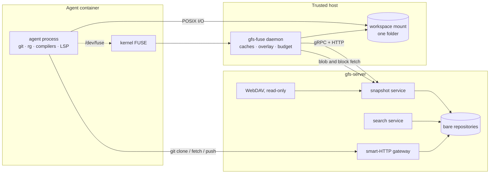

| process | runs where | responsible for |
| --- | --- | --- |
| `gfs-server` | the repository service | imports bare repos, resolves revisions, serves trees/blobs, search, history, LFS expansion, the Git wire protocol, WebDAV |
| `gfs-fuse` | the trusted host, one per machine | serves every FUSE request for every mount on that host; owns the caches, the overlay, and the hydration budget |
| `gfs` | inside the job | the agent-facing CLI: `mount`, `status`, `commit`, `search`, `inspect`, and the `PATH` shims |

FUSE privilege stays in the host daemon (ADR 0003). The job gets a bind-mounted
directory and a scoped control socket — never a credential.

---

## 2. One workspace folder

A workspace is a single self-contained directory (ADR 0011). Inside it, two
subtrees behave differently and there is no merged namespace between them.

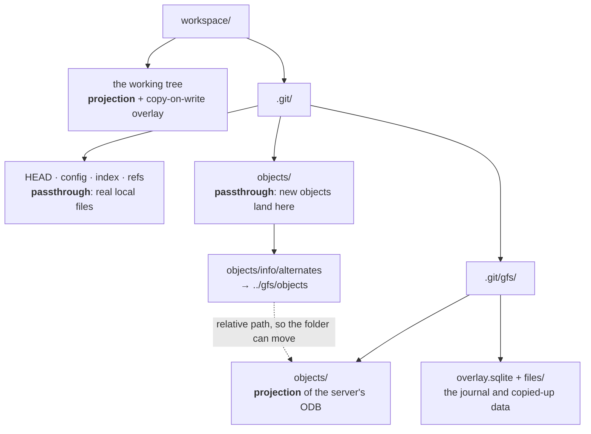

- **Projection** — read-only, served from the server, materialized on demand.
- **Passthrough** — real files on the host's disk, written by whatever tool
  wants to. The daemon creates the folder with a real `.git` inside it, keeps
  open handles to it, then mounts *over* the folder, so those files are shadowed
  and reachable only through the mount.

The one-line `alternates` file is what removes the need to union the projection
into `objects/pack/` — a stock Git mechanism doing the job that would otherwise
have been the riskiest FUSE logic in the design.

---

## 3. Mounting a commit

Ordering is the design. `CreateMount` is one atomic server-side operation, and
it runs *before* anything local exists, so there is no window in which the
daemon is serving a commit it has not pinned.

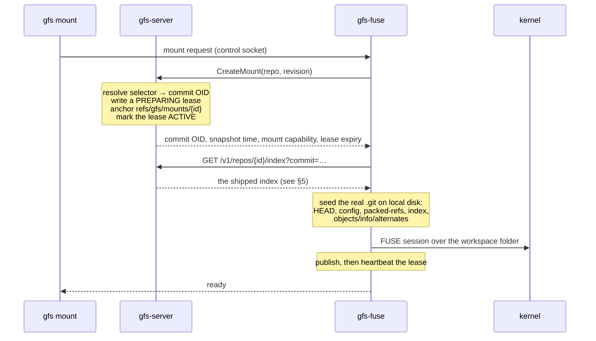

Teardown runs in the opposite order — unpublish, unmount, release — because
releasing the lease while a mount can still read through it is the same window
with the sign flipped.

A branch name is only a selector. Everything after `CreateMount` names the
resolved commit OID, so the mount never moves when the branch advances, and
metadata from one generation can never be combined with content from another.

`gfs switch`, `gfs refresh`, and the re-pin after `gfs commit` all repeat this
in place: same mount, same path, no second FUSE session.

---

## 4. Reading a path

Every lookup crosses three worlds in a fixed order. The order lives in exactly
one place, `Gfs::resolve_path`.

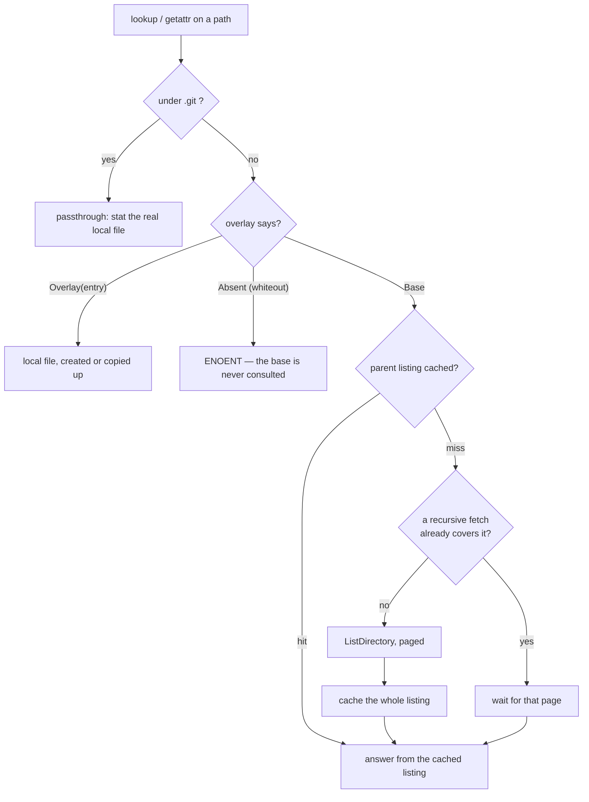

The key property: the commit is **immutable**, so one complete directory listing
answers both "what are this directory's children" and "no, that name does not
exist here" — permanently. That is what makes a warm `git status` cost zero round
trips, and why the daemon keeps listings even though the kernel will not.

Opening a file adds one step: `open` checks the blob cache, and on a miss
charges the hydration budget *before* fetching, so an over-budget job fails at a
named file with `EDQUOT` rather than after spending what the budget existed to
protect.

### The three client caches

| cache | keyed by | scope | why that scope |
| --- | --- | --- | --- |
| listing cache | directory path | per pin | listings describe one commit; a repin drops them all by construction |
| blob cache | object ID | per repository, shared across mounts | an OID names the same bytes forever, so two workspaces cannot disagree |
| block cache | (pack file, block index) | per repository, shared across mounts | a pack's filename is its own checksum, so a cached block cannot go stale |

Bounds that matter: the listing cache holds 32 768 directories and 150 000
entries — sized so a monorepo's whole directory structure fits, because a walk
now fills it in one operation. Blob cache entries are written to a temp file,
hashed as a canonical Git blob, and atomically renamed, so a cache hit is
cryptographically the same object a server fetch would have produced.

---

## 5. The cold walk

A warm tree is cheap; the *first* traversal is the problem. `git status` on a
fresh vscode workspace walks 4 318 directories, and one round trip each is
thousands of serialized requests.

The daemon reads the access pattern instead of guessing.

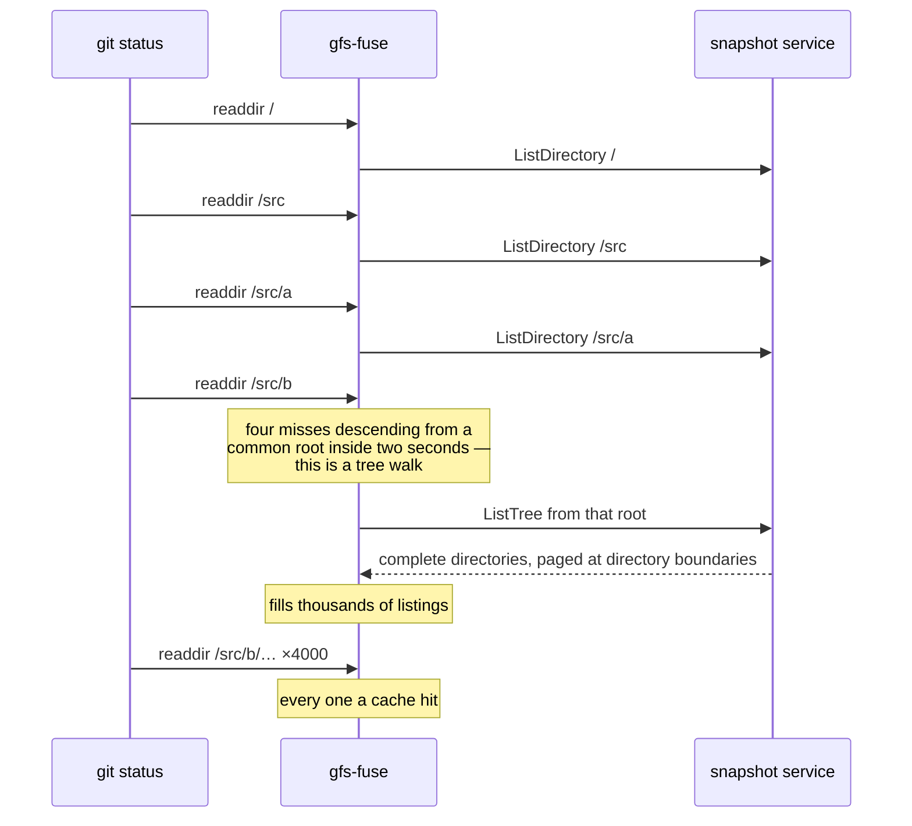

Two detectors, both requiring evidence before they spend anything:

- **Walk detector** — four listing misses inside two seconds fire one `ListTree`
  for their common ancestor. A miss that lands inside an in-flight subtree
  *waits* for it rather than racing it: locally that trades ~1 ms, over a network
  it is one round trip instead of thousands.
- **Read detector** — three distinct files read out of one directory means the
  directory is being read through, so the rest of it is fetched in the
  background, bounded per file, per directory, and by what is left of the budget.

Nothing prefetches on a first miss or a first read. A job that opens one file
pays for one file, or this becomes the whole-tree materialization ADR 0009
refused. Prefetching also stops with 25 % of the budget unspent, so a wrong
guess can never be the reason a real read gets `EDQUOT`.

Pages break between directories, never inside one — half a directory cannot
answer the absence of a name, which is the property the cache exists for.

---

## 6. The object database projection

Since ADR 0009 the workspace carries a real object database, so `log`, `blame`,
`status`, and `commit` are stock Git rather than reimplementations. What it does
*not* carry is the pack bytes.

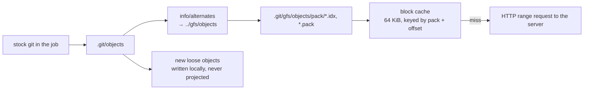

The projection advertises the server's pack files at their true sizes; reads are
served in 64 KiB blocks. That size was measured, not chosen: object access is
sparse and random — a binary search in the `.idx`, a delta chain through the
`.pack` — so large chunks fetch bytes nobody reads.

| chunk | `log --oneline -20` | `blame` |
| --- | ---: | ---: |
| **64 KiB** | **0.3 MiB** | **274 MiB** |
| 1 MiB | 2 MiB | 1 004 MiB |
| 8 MiB | 16 MiB | 2 320 MiB |
| 32 MiB | 64 MiB | 3 648 MiB |

It also matches FUSE's 128 KiB maximum read, so one block serves one request and
there is nothing to tune.

The projection is read-only, with one deliberate exception: a times-only
`utimensat` succeeds as a no-op. Git touches a pack before reusing an object
from it, to keep `gc` from pruning it, and treats a failed touch as "cannot
vouch for this object" — so refusing it made Git write a duplicate loose copy of
everything GFS already had. There is nothing here for `gc` to prune, so
accepting the call is a lie with no consequence. Mode, size, and owner are still
`EROFS`.

---

## 7. The shipped index

`.git/index` is not a list of paths — it is a binary file with four sections,
and GFS ships the whole thing.

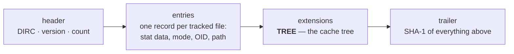

**Where it is built.** On the server, by walking its own local object database
(`index_for_commit`). Building it client-side would mean walking the whole tree
through the snapshot API — the metadata sweep GFS exists to avoid. It is served
over HTTP with `ETag: "<commit>"` and `Cache-Control: immutable`, because the
bytes are a pure function of the commit and its snapshot time.

> Not cached in-process: the same commit mounted 100 times is built 100 times,
> at ~26 ms for django and ~67 ms for vscode. The endpoint's headers make it
> cacheable by anything in front of the server; nothing inside does it yet.

**Where it lives.** On local disk at `.git/index`, in the passthrough, written
atomically at mount and at each repin. After that it is Git's file: every
`git add` and `git commit` rewrites it in place, and GFS never touches it again.

**The stat data is the point.** `git status` compares each entry against `lstat`
of the working tree, and with real values from another filesystem every entry is
stat-dirty and Git re-hashes the whole tree — measured at 1 615 MiB on the Linux
kernel. So every entry records `mtime = snapshot_time` (the deterministic
per-commit time the projection also reports, identical on every host), the true
size, and zeros for `dev`/`ino`/`uid`/`gid`/`ctime` — which is why the seeded
config sets `core.checkStat=minimal` and `core.trustctime=false`, the settings
that exclude exactly those fields.

### The cache tree

The `TREE` extension is a memo, one record per directory:

```
<path component>\0<entry_count> <subtree_count>\n<20-byte tree OID>
```

`entry_count` is recursive — every index entry beneath that directory. The OID
is the directory's real tree object. Together they say *"this directory is
unmodified and hashes to this."*

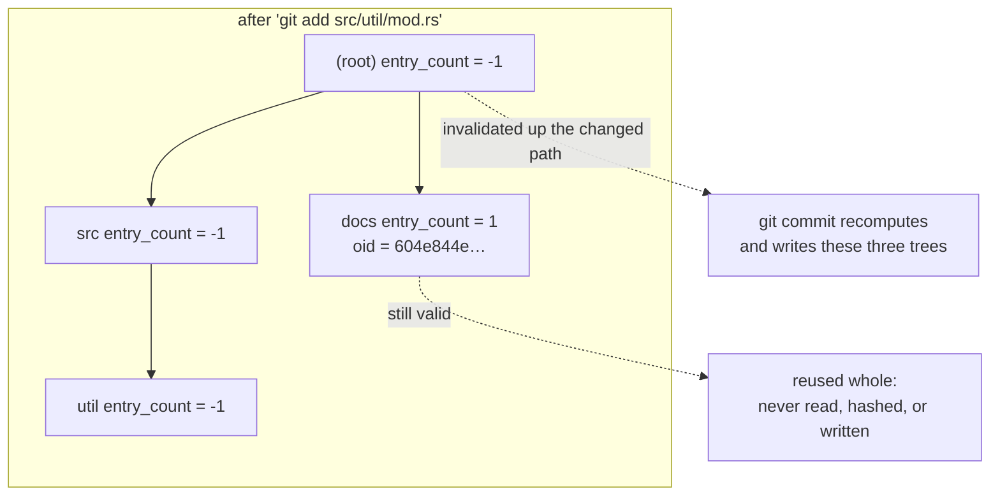

Without the extension, *every* node is effectively invalid, so the first commit
in a workspace re-derives every tree in the repository. On vscode that was
4 299 objects written for a five-file change, and 12.3 s. Only the first commit,
because Git persists the cache tree it was forced to build — which is exactly
the commit an agent job makes.

Two subtleties, both load-bearing:

- **Git trusts a well-formed cache tree.** A wrong OID or count is reused whole
  and produces a wrong commit tree with no diagnostic. So the writer re-derives
  every count from the entry list before serializing.
- **Cache-tree order is not Git tree order.** A Git tree sorts a directory as
  though its name ended in `/`; a cache tree sorts subtrees shorter-name-first,
  then by bytes. A tree lists `aa, ab, a-b, a.b, b, c, zzz, a` where a cache tree
  lists `a, b, c, aa, ab, zzz, a-b, a.b`. Live in the corpus: one directory in
  django, seventeen in vscode.

---

## 8. Writing, and getting work back out

The base is immutable, so every mutation lands in a per-job overlay: a SQLite
journal of path state beside a directory of file data.

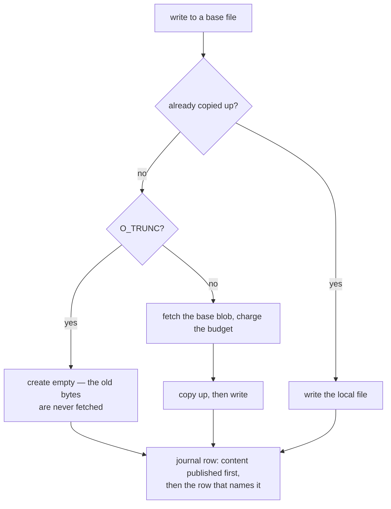

Deletes write whiteouts rather than removing anything; a re-creation at the same
path is reported as a replacement, not an addition, because the row remembers
what it hid. Every row is held in memory and mirrored to SQLite — reads never
touch the database — which is affordable because the row count is bounded by
what one job edits, not by the size of the repository.

`gfs status` reads that journal directly, which is why it costs ~10 ms against
~70 ms for `git status` on a warm tree and no full-tree walk at all.

There are two ways work leaves the workspace:

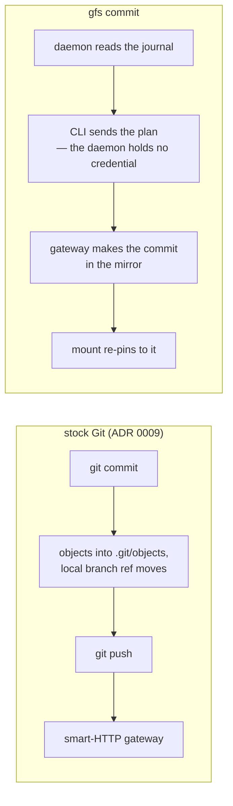

The daemon collects and the CLI sends, deliberately: the control socket carries
no credential, and a commit must be attributed to the caller rather than to
whatever token the daemon was started with.

---

## 9. Search

Search is the one question a projected tree cannot answer cheaply — grepping
locally would hydrate everything — so it is answered on the server, over a
revision.

- Trigram posting lists in roaring bitmaps over a Tantivy index, built per
  snapshot.
- An unready index is an **error**, not an empty result: exit code 2 with
  `SNAPSHOT_BUILDING` (ADR 0004). A silent empty answer to "does this symbol
  exist" is worse than a slow one.
- The answer reports what it did *not* read, on stderr — binary, LFS, oversized
  — so a partial result is visibly partial.
- `gfs rg` and `gfs find` are argv-compatible spellings installed by the shims
  (ADR 0007); an unimplemented flag is refused *by name at parse time*, before
  any output exists, and the real tool runs over the mount instead — slow rather
  than wrong.

A repository-wide search moves zero file bytes to the client. The hydration
counters are byte-identical either side of searching all 17 926 files in vscode.

---

## 10. Authorization and budgets

Every snapshot request has to establish that this caller may read this object
from this repository (ADR 0002).

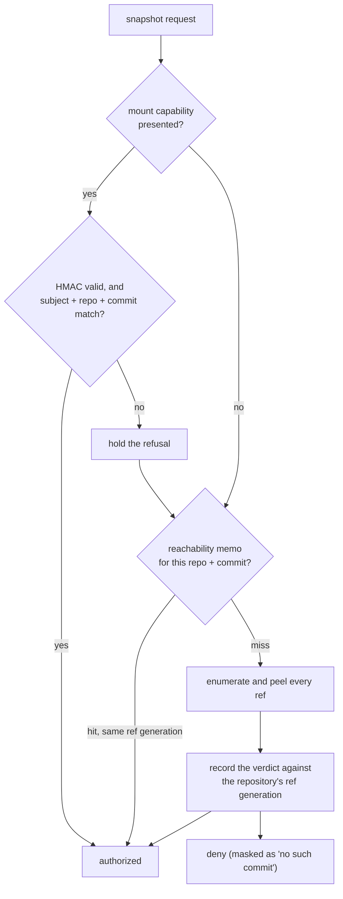

A mount capability is signed by this server and binds subject, repository, and
commit — the same fact the ref scan establishes, for one HMAC. The refusal is
*held* rather than returned immediately so that an expired capability is still
reported to its owner as `Expired` rather than masked behind a not-found.

The memo is keyed by `(repository, commit)` and stamped with the repository's
ref generation, which every catalog-visible ref change bumps. A TTL backs it up
for changes made underneath the server: 10 s for reachable, 2 s for not —
asymmetric because refusing a commit that just became reachable is a visible
failure on a fresh push, while serving one a moment past its last ref is not.

This mattered more than it sounds. Before the memo, that scan was ~100 % of a
directory listing's server time — 24–28 ms peeling 73 989 refs around a tree
read costing 2.5 µs.

### Two budgets

| budget | counts | on a limit |
| --- | --- | --- |
| hydration | bytes *fetched* by one job, charged once per blob | `EDQUOT` at `open` — fail loudly at a named file |
| ODB residency | bytes *held* on disk by the block store | evict and re-fetch, never refuse (SLRU, scan-resistant) |

The hydration budget is 1 GiB and **on by default**, which is the point: a
budget that has to be switched on is not enforcement. The number sits between
the two behaviours it must tell apart — a full re-hash of the Linux kernel's
working tree is 1 540 MiB and trips it, while every measured well-behaved
command is orders of magnitude below.

---

## 11. Where the code lives

| crate | holds |
| --- | --- |
| `gfs-git` | libgit2 behind a `GitRepository` trait — objects, trees, refs, the index and its cache tree, attributes, worker pools |
| `gfs-service` | server internals: catalog, auth, mirror, ingest, LFS, search services, the smart-HTTP gateway, mounts and leases, audit |
| `gfs-search` | trigram postings, snapshot manifests, blob registry, text classification, local overlay search |
| `gfs-mount` | the FUSE filesystem: inodes, attributes, listings, blob and block caches, budget, prefetch, the gitdir passthrough and ODB projection, host and control sockets |
| `gfs-overlay` | the journal, copy-up store, status, diff, export, merge, fault injection |
| `gfs-types` / `gfs-proto` | byte paths, OIDs carrying their algorithm, revisions, limits, redaction; the protobuf surface |
| `gfs-test` | fixtures, mount harness, a million-entry big-tree corpus, a real-Git oracle |

Binaries: `gfs-server`, `gfs-fuse`, `gfs` (CLI), plus the shim binaries the agent
image installs on `PATH`.

---

## 12. Reading further

| for | read |
| --- | --- |
| why any of this is the way it is | [`adr/`](adr/) — twelve decision records |
| the object authorization boundary | [ADR 0002](adr/0002-git-object-authorization-boundary.md) |
| why the workspace carries a real ODB | [ADR 0009](adr/0009-raw-git-over-a-projected-object-store.md) |
| why one folder, not two | [ADR 0011](adr/0011-single-mount-workspace.md) |
| measured numbers, end to end | [`../benchmarks/agent-workflow.md`](../benchmarks/agent-workflow.md) |
| the narrative version, with charts | [`overview.html`](overview.html) |
| running it locally | [`../README.md`](../README.md), [`manual-test.md`](manual-test.md) |
