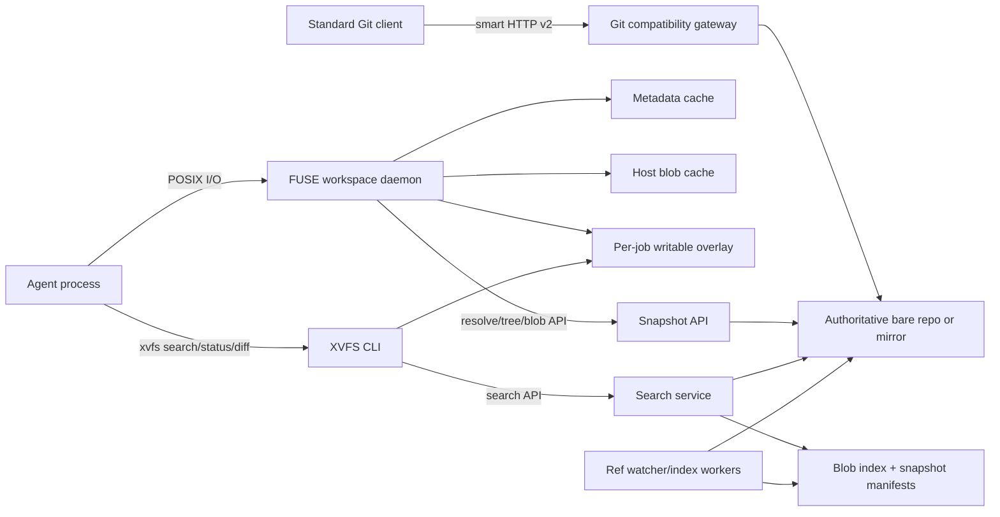

# XVFS: Agent-Oriented Virtual Git Workspace

Status: Draft; core implementation choices accepted  
Audience: engineering, infrastructure, security, and agent-platform teams  
Target platform: Linux-hosted coding agents  

## 1. Summary

XVFS is a Git-compatible repository service and a Rust FUSE client for short-lived,
hosted coding-agent jobs. A job mounts an immutable Git snapshot, sees a normal
directory tree, and downloads file data only when a process opens a file. Writes go
to a local copy-on-write overlay. Code discovery uses a revision-aware server search
API so that searching a monorepo does not hydrate the entire working tree.

The closest existing options solve parts of the problem:

- Git partial clone can omit blobs and fetch missing objects on demand, but dynamic
  object fetching may be one object at a time and ordinary checkout/search behavior
  can still pull a large working set. Git's own design notes call out that cost.
- Sparse checkout and Scalar help when the needed paths are known in advance. An
  agent often needs repository-wide discovery before it knows those paths.
- VFS for Git presents a virtual working directory and downloads objects on demand,
  but its published implementation is Windows-oriented, needs a cooperating Git
  service, and now recommends Scalar for new deployments.
- EdenFS is an important architectural reference, but adopting its wider source
  control stack is a much larger integration than a small Git-compatible service.

There is therefore room for an agent-specific solution. The novel part is not FUSE
alone; it is the combination of a pinned snapshot, copy-on-write edits, remote
revision-correct code search, hydration accounting, and an agent-facing tool
contract.

## 2. Goals

1. Start a workspace without cloning repository history or materializing every file.
2. Present enough POSIX filesystem behavior for editors, compilers, and common agent
   tools.
3. Fetch directory metadata and file blobs lazily and cache immutable data across
   jobs on the same trusted host.
4. Search tracked source at an exact branch tip or commit without reading every file
   through FUSE.
5. Preserve local edits, additions, deletions, renames, executable bits, and
   symlinks in a crash-consistent overlay.
6. Export a patch and, later, create and push ordinary Git commits.
7. Allow unmodified Git clients to clone/fetch from the server using Git smart HTTP
   protocol v2.
8. Make authorization, auditing, observability, and resource limits first-class.

## 3. Non-goals

The first production version will not:

- replace all Git porcelain;
- transparently make every Git command fast over the mounted tree;
- support macOS or Windows filesystems;
- provide a general distributed search engine;
- index generated or untracked build outputs;
- recursively mount submodules;
- provide offline access to files that were never cached;
- guarantee that arbitrary programs cannot hydrate the tree. FUSE sees file opens,
  not the user's intent behind them.

## 4. User experience

An orchestrator creates one mount per job:

```text
xvfs mount \
  --repo acme/monorepo \
  --rev refs/heads/main \
  --state /var/lib/xvfs/jobs/job-123 \
  /work/repo
```

The client resolves `refs/heads/main` once and pins the resulting commit. The mount
does not change under the process if the branch advances.

The agent uses normal file operations for known files and a dedicated command for
discovery:

```text
xvfs search 'RequestContext' --glob 'services/**/*.rs'
xvfs search --regex 'fn\s+authorize_' --json
xvfs status
xvfs diff --format git
```

`xvfs search` combines server results for the pinned base commit with a local search
of modified and newly created overlay files. Deleted or replaced base paths are
removed from server results. This is necessary for search to remain correct after
the agent starts editing.

At job completion the orchestrator runs `xvfs diff` or `xvfs export`. A later phase
adds `xvfs commit` and compare-and-swap branch updates.

## 5. System context



The Git object database remains authoritative. Search indexes, decoded-blob caches,
manifests, and client caches are derived and can be rebuilt.

### 5.1 Accepted implementation choices

The prototype will use the following implementation:

- the server and client applications are written in Rust;
- server-side repository access uses libgit2 through the `git2-rs` bindings;
- stock `git upload-pack` is executed as a sandboxed child process behind the Rust
  smart-HTTP gateway for clone/fetch compatibility;
- the Linux filesystem uses `cberner/fuser`;
- the FUSE client reads individual files through the XVFS snapshot/blob API, not
  through `upload-pack`.

Using libgit2 and `upload-pack` means the deployable server includes C components,
but application control flow, APIs, authorization, search, orchestration, and
filesystem behavior remain implemented in Rust. A native Rust Git wire-protocol
engine is not in the planned scope.

## 6. Core design decisions

### 6.1 Git is the source of truth

XVFS does not invent a new commit, tree, or blob format. Repository data remains
valid Git data, addressed by the repository's object hash algorithm. Internal IDs
must carry the algorithm as well as the digest; code must not assume a 20-byte
SHA-1 object ID because Git pack formats also support SHA-256 repositories.

Use libgit2 through `git2-rs` for object parsing, tree traversal, refs, diffs, object
creation, revision walks, and object-database access. Isolate it behind a
`GitRepository` trait so FFI lifetimes, blocking work, library upgrades, and
conformance details do not leak into HTTP, search, or FUSE code. Repository and
pack-builder handles are not shared concurrently; blocking libgit2 operations run
in bounded worker pools.

### 6.2 Pin every workspace to an immutable commit

A branch name is only a selector. `Mount` or `ResolveRevision` returns a commit OID,
and all later tree, blob, and search requests name that OID. Responses repeat the
resolved commit. This prevents a file from one branch generation being combined with
search results or metadata from another generation.

An explicit `xvfs refresh` may move a clean workspace to a new commit. Refresh with
local changes requires a three-way rebase operation and is not part of the MVP.

### 6.3 Keep extensions outside the Git wire protocol initially

Git protocol v2 is command-oriented and extensible, but file, tree, and search APIs
have different caching, streaming, error, and authorization needs from pack
negotiation. The first version exposes:

- standard Git smart HTTP endpoints for stock Git clients;
- a versioned gRPC snapshot/search API for the Rust client;
- an HTTP immutable-blob endpoint for range requests, CDN caching, and debugging.

A future server can advertise custom protocol-v2 commands, but they should be a
gateway onto the same internal services rather than a second implementation.

### 6.4 Use a writable overlay, not a writable remote snapshot

The mounted base is immutable. Local mutations are recorded in a per-job overlay:

- a journal/catalog records path state and metadata;
- created or modified content is stored as regular local files;
- a whiteout represents a deleted base path;
- a rename is journaled atomically;
- the executable bit and symlink target are preserved.

On the first write to an existing file the client copies the blob into the overlay.
`O_TRUNC` avoids downloading old content when the caller is replacing the whole
file. Reads use overlay content first and fall back to the pinned base.

This model makes failure recovery and patch export tractable. It also avoids a
virtual `.git/index` whose behavior would be tightly coupled to every Git command.

### 6.5 Search immutable blobs, filter by snapshot membership

Indexing every path/content occurrence for every commit would multiply storage.
Instead, each unique searchable blob in a repository receives a stable numeric
`blob_key` and is indexed once. A snapshot manifest supplies:

- a sorted `path -> (mode, object_id, blob_key)` table;
- a `blob_key -> path(s)` reverse table;
- a Roaring bitmap containing blob keys reachable from the snapshot.

Literal search uses a trigram posting index whose values are blob-key bitmaps.
Posting lists are intersected with the snapshot bitmap, then candidate bytes are
verified to produce exact line, column, and snippet results. Regex search extracts
required literals/trigrams when possible and uses `regex-automata` for bounded
verification. Broad regexes with no useful literal are subject to scan and time
budgets.

Tantivy provides optional tokenized/ranked full-text search. Each indexed document
stores `blob_key` as a fast field. A custom snapshot filter maps the stable
blob-key bitmap into segment-local document bitmaps and caches that mapping.
Literal/regex search is the default for code because its behavior is closer to
`ripgrep`; token search is an explicit mode.

Configured branch tips are prepared eagerly. For an arbitrary commit, the server
builds and caches the immutable snapshot manifest on demand. The API may return an
operation ID when preparation exceeds the request deadline. It never silently
searches an older branch tip.

## 7. Server architecture

### 7.1 Repository manager

The repository manager owns authoritative bare repositories or read-through mirrors
of an upstream Git host.

Responsibilities:

- create, fetch, repack, verify, and remove mirrors;
- resolve refs, tags, and abbreviated object IDs under an authorization context;
- serialize ref mutations per repository;
- emit a durable ref-change event after a successful update;
- reconcile catalog state with refs after a crash or missed webhook;
- enforce repository quotas and run Git maintenance.

For a proxy deployment, ingestion uses webhooks plus polling. For an authoritative
deployment, receive-pack creates the ref-change event. Ref events are idempotent and
keyed by `(repository_id, ref_name, old_oid, new_oid)`.

### 7.2 Git compatibility gateway

Required initial compatibility is read-only Git smart HTTP:

- `GET .../info/refs?service=git-upload-pack`;
- `POST .../git-upload-pack`;
- protocol v2 `ls-refs` and `fetch`;
- shallow and partial-clone filters supported by the deployed stock Git version.

Push/`git-receive-pack`, SSH transport, and unauthenticated `git://` are later
milestones. Smart HTTP is the best first transport for hosted jobs because it works
with existing TLS, proxies, and bearer credentials.

The accepted implementation is a Rust gateway that authenticates, authorizes,
limits, and streams requests to a sandboxed stock `git upload-pack` child process.
No shell is involved; the executable, arguments, repository path, accepted
`GIT_PROTOCOL` values, configuration, environment, and resource limits are fixed by
the gateway.

`upload-pack` is Git's read-side wire service: it advertises refs and capabilities,
accepts the client's wanted and existing objects, calculates the missing object
closure, invokes pack generation, and returns a packfile. It does not handle pushes;
that is the separate `receive-pack` service.

For smart HTTP, the gateway maps the two request phases as follows:

1. `GET .../info/refs?service=git-upload-pack` runs
   `git upload-pack --http-backend-info-refs <bare-repository>` and returns the
   capability/ref advertisement.
2. `POST .../git-upload-pack` runs
   `git upload-pack --stateless-rpc <bare-repository>`, streams the request to
   stdin, and streams stdout as `application/x-git-upload-pack-result`.

For protocol v2, the gateway validates the `Git-Protocol` header and passes the
negotiated value in `GIT_PROTOCOL`. The subprocess implements pkt-line framing,
`ls-refs`, want/have negotiation, shallow behavior, partial-clone filters, pack
deltas, and sideband output. XVFS still owns authentication, repository selection,
HTTP validation, deadlines, cancellation, concurrency limits, and auditing.

libgit2's pack builder is useful for XVFS-created objects and later commit/export
features, but libgit2 does not provide a drop-in server-side upload-pack state
machine. Reimplementing capability advertisement, negotiation, filtering,
reachability security, and sideband streaming on libgit2 would add substantial
compatibility risk without improving the agent workspace. It is therefore not part
of the planned implementation.

The snapshot and blob services never invoke `upload-pack`. They use `git2-rs`
directly to resolve a pinned commit, traverse its tree, find the blob OID, and return
decoded file bytes. This avoids pack negotiation and construction for a one-file
FUSE read.

### 7.3 Snapshot service

Proposed RPCs:

```text
ResolveRevision(repo, revision_selector)
  -> { commit_oid, tree_oid, ref_name?, ref_version }

GetEntry(repo, commit_oid, path_bytes)
  -> { kind, mode, oid, size, symlink_target? }

ListDirectory(repo, commit_oid, path_bytes, page_token, page_size)
  -> { entries[], next_page_token }

BatchGetEntry(repo, commit_oid, path_bytes[])
  -> { results[] }

PrepareSnapshot(repo, commit_oid)
  -> { state: READY | BUILDING, operation_id? }

Search(repo, commit_oid, query, mode, path_globs, limits)
  -> stream { path_bytes, line, column, snippet, blob_oid, commit_oid }
```

Paths are bytes in the protocol, not assumed UTF-8. CLI JSON includes a lossless
escaped representation.

The convenience file endpoint is:

```text
GET /v1/repos/{opaque_repo_id}/file?rev={selector}&path_b64url={encoded_path}
```

It atomically resolves the selector and returns headers containing the resolved
commit, Git mode, blob OID, and size. The low-level immutable endpoint is:

```text
GET /v1/repos/{opaque_repo_id}/blobs/{algorithm}:{oid}?ticket={short_lived_ticket}
Range: bytes=start-end
If-None-Match: "{algorithm}:{oid}"
```

Using base64url for the byte path avoids ambiguous URL normalization of non-UTF-8
names and encoded slashes. Blob authorization requires both repository access and
proof that the requested blob is reachable from an allowed revision. `GetEntry` or
the convenience endpoint returns a short-lived ticket binding repository, commit,
blob OID, subject, and expiry; a CDN/object-store signed URL can carry the same
decision.

### 7.4 Tree and blob serving

Git trees are already hierarchical manifests, so listing one directory only needs
the commit/tree path plus the immediate tree object. `GetEntry` traverses tree
objects along one path. Server-side caches store decoded trees by OID.

For the MVP, opening a file downloads the complete decoded blob. Whole-blob caching
is simple, makes Git OID verification straightforward, and is appropriate for most
source files. A later large-file extension may return a chunk manifest and serve
byte ranges. That extension must still verify the reconstructed Git blob hash and
must not confuse chunk hashes with Git object IDs.

Blob responses are immutable, use OID-based ETags, and may be cached on local SSD or
object storage. The server verifies the Git object header and digest before
publishing a derived decoded blob.

### 7.5 Search ingestion

The index pipeline for a ref update is:

1. Resolve and validate the new commit.
2. Diff its root tree against the previous indexed tip when possible.
3. Assign blob keys and index unseen textual blobs.
4. Build the new path table, reverse path table, and reachability bitmap.
5. Commit index segments and the snapshot manifest.
6. Atomically mark `(repo, commit)` ready.

A first snapshot or unrelated commit is built by a parallel tree walk. Repeated
blobs are deduplicated by OID. Binary files and blobs over a configurable limit
(suggested default: 8 MiB) are excluded from content search but remain available
through file APIs. Index state records the exclusion reason.

Search responses carry the exact commit OID and index generation. Time, result,
candidate-byte, and regex-complexity limits are enforced server-side.

### 7.6 Storage

Single-node prototype:

- bare Git repositories on local SSD;
- SQLite for repository, ref, job, and index catalogs;
- immutable manifest/index files on local SSD;
- decoded blob cache on local SSD;
- Tantivy plus custom trigram and Roaring-bitmap files.

Scaled deployment:

- shard repositories to owner nodes instead of distributing one search query;
- PostgreSQL for the control-plane catalog and durable job/outbox state;
- object storage for immutable decoded blobs, manifests, and index snapshots;
- local NVMe caches for packs and active search indexes;
- replicas load immutable index generations and swap them atomically;
- a queue delivers idempotent indexing and garbage-collection work.

Tantivy is a library, not a distributed service. Repository sharding keeps the
system understandable and allows an index to be rebuilt from Git if derived storage
is lost.

### 7.7 Service technology

Accepted implementation stack:

| Concern | Technology | Rationale |
| --- | --- | --- |
| Runtime | Tokio | Mature async networking and cancellation |
| HTTP/Git gateway | Axum, Hyper, Tower | Streaming bodies and middleware composition |
| RPC | Tonic + Prost | Typed streaming API shared by server and client |
| TLS | rustls | Rust-native TLS |
| Git objects | libgit2 via `git2-rs` | Mature repository, ODB, tree, diff, ref, and pack-building APIs |
| Git wire read service | stock `git upload-pack` child process | Exact clone/fetch protocol behavior without reimplementing negotiation |
| FTS | Tantivy | Embedded Rust token search and immutable segments |
| Literal/regex | custom trigrams + `regex-automata` | Exact code-search semantics with bounded matching |
| Snapshot sets | `roaring` | Compact and fast bitmap intersections |
| Prototype catalog | SQLite via `rusqlite` | Simple transactions and recovery |
| Production catalog | PostgreSQL via SQLx | Durable multi-node coordination |
| Serialization | Protobuf for APIs; versioned internal formats | Explicit compatibility |
| Telemetry | `tracing`, OpenTelemetry, Prometheus metrics | Cross-client request and hydration traces |
| CLI/config/errors | Clap, Serde, `thiserror`/`anyhow` | Conventional Rust tooling |

Exact versions should be pinned after the spikes in the plan, followed by automated
dependency update and compatibility testing.

## 8. Client architecture

### 8.1 Processes and deployment

`xvfs` is the user CLI. `xvfsd` owns the FUSE session, caches, network clients, and
overlay.

FUSE inside a container generally requires `/dev/fuse` and additional privilege.
The preferred hosted deployment runs `xvfsd` as a trusted host service or Kubernetes
CSI node component, then bind-mounts a per-job workspace into the unprivileged agent
container. Direct in-container mounting is supported only on platforms that safely
expose FUSE. A selective `xvfs materialize` mode is a fallback for environments
where mounting is impossible, but is not the primary architecture.

Credentials belong to the host daemon where possible. A job receives only a mount
handle and scoped CLI socket, reducing token exposure inside the workload.

### 8.2 FUSE operation mapping

`xvfsd` implements the `fuser::Filesystem` trait from `cberner/fuser`. Network and
other blocking storage work never runs on a FUSE callback thread without a bound;
callbacks submit work to bounded executors and preserve cancellation and request
deadlines.

| Operation | Behavior |
| --- | --- |
| `lookup`, `getattr` | Overlay lookup, then cached/remote entry lookup |
| `readdirplus` | Merge base directory page with overlay additions, renames, and whiteouts |
| `open`, `read` | Overlay file or immutable blob cache; fetch once on miss |
| `create`, `mkdir` | Allocate overlay inode and journal transaction |
| `write`, `truncate` | Copy up when needed, then mutate local overlay |
| `unlink`, `rmdir` | Remove overlay entry or create base whiteout |
| `rename` | Atomic overlay journal transaction; copy-up metadata as needed |
| `readlink`, `symlink` | Preserve Git symlink semantics with safety policy |
| `setattr` | Support size, executable bit, and timestamps; reject unsupported modes |
| xattrs, device nodes | Return a documented unsupported error in the MVP |

Base inodes are stable for the life of the mount and derived from the mount identity
plus entry identity. Overlay inodes are allocated persistently. Kernel attribute and
entry TTLs are long because the base commit is immutable; overlay mutations issue
the necessary invalidations.

Git modes supported initially are regular non-executable, regular executable,
symlink, directory, and gitlink. A gitlink appears as an empty, read-only directory
with inspectable XVFS metadata; recursive submodule mounting is explicit and later.

### 8.3 Local state

Each job has:

```text
state/
  mount.json              pinned repo, commit, format version
  overlay.sqlite          path/inode journal and transactions
  files/                  created and copy-up file data
  locks/
  telemetry/
```

The host has an optional cache:

```text
cache/
  trees/
  blobs/
  metadata.sqlite
```

Cache entries are written to a temporary file, hashed as a canonical Git blob, then
atomically renamed. Eviction is quota-based LRU and never removes open entries.
Plaintext deduplication is scoped to a repository or explicitly trusted
authorization domain; cross-tenant global deduplication risks data leakage and
content-existence side channels.

### 8.4 Hydration policy

The client records, per process where available:

- blob count and bytes fetched;
- metadata requests and directory entries fetched;
- cache hits;
- reads avoided by remote search;
- top hydrating commands and paths.

Mount options set soft and hard byte/file budgets. A soft limit emits warnings and
telemetry. A hard limit returns `EDQUOT` for new remote hydration while preserving
overlay and cached access. Hard limits are opt-in because a build may legitimately
need many files.

An `xvfs-rg` compatibility wrapper translates a deliberately small, documented
subset of common `rg` flags into `xvfs search`; unsupported options fail with a
message unless `--hydrate` is explicitly requested. Hosted agent images place this
wrapper early in `PATH` and include an `AGENTS.md` instruction. An MCP or native
agent tool should expose the same search API. This is defense in depth, not a
filesystem guarantee: a program that directly opens every file will still hydrate
every file unless a hard budget stops it.

### 8.5 Status, diff, export, commit

`status` is derived from the overlay journal and does not scan the base tree.
`diff` reads only changed overlay files and their base blobs. It can emit:

- human-readable unified diff;
- Git-compatible patch;
- JSON change manifest plus content files.

Binary and mode changes are represented explicitly. Export is atomic and includes
the base commit so a downstream applier can reject or three-way merge stale work.

Later, `commit` hashes overlay files, rewrites only affected Git trees, creates a
commit, and asks the server to update a branch with:

```text
expected_old_oid = workspace base or last refreshed tip
new_oid = created commit
```

The server performs a compare-and-swap ref transaction. A mismatch never silently
overwrites another writer.

## 9. Consistency and failure behavior

- A mounted base never changes implicitly.
- Immutable tree/blob caches are keyed by repository hash algorithm and OID.
- Ref resolution has a short TTL; commit/tree/blob data may be cached indefinitely
  subject to space limits.
- A search is correct only when its snapshot manifest and index generation are
  ready. `BUILDING`, `NOT_INDEXABLE`, and `RESOURCE_LIMIT` are distinct errors.
- Network loss returns retryable I/O errors for uncached base data. Overlay writes
  and cached reads continue.
- Overlay mutations commit metadata and file rename/fsync in a documented order.
  On restart, journal recovery either completes or rolls back each transaction.
- Unmount does not discard an overlay. Job cleanup is a separate, auditable action.

## 10. Security

1. Authenticate every Git, snapshot, blob, and search request.
2. Authorize repository and revision access before resolving paths or exposing
   index-derived snippets.
3. Normalize URL paths at the gateway, but keep repository paths as validated byte
   strings; reject NUL and `/` within individual components.
4. Prevent repository identifiers and revisions from becoming filesystem or command
   arguments without typed validation.
5. Sandbox Git compatibility subprocesses with fixed environment, resource limits,
   no hooks, no arbitrary upload-pack path, and read-only repository access.
6. Bound decompression ratios, blob sizes, regex work, result counts, and concurrent
   FUSE requests.
7. Verify every cached object cryptographically before publication.
8. Partition caches and metrics so object existence is not leaked across tenants.
9. Audit ref resolution, file download, search, export, and push by job and user.
10. Default to safe symlink handling in hosted environments: reject absolute links
    and links that escape the mount, with an explicit compatibility opt-out.
11. Keep FUSE privilege in a trusted host/CSI component, not the agent container.

## 11. Performance targets

These are prototype acceptance targets to validate against representative
monorepos, not guaranteed SLOs:

| Metric | Target |
| --- | --- |
| Cold mount to usable root | under 2 seconds, under 10 MiB downloaded |
| Cached `getattr` | p95 under 1 ms client-side |
| Uncached root `readdirplus` | p95 under 250 ms in-region |
| Uncached source file first byte | p95 under 250 ms in-region |
| Warm literal search on an indexed branch | p95 under 2 seconds |
| Search-induced client blob hydration | zero bytes |
| Client disk for a job | overlay + bounded shared cache, independent of repository history size |
| Crash recovery | no lost acknowledged overlay mutation in fault-injection tests |

The benchmark report must also compare network bytes, local disk, startup time, and
task completion time against full clone, `--filter=blob:none`, and sparse checkout.

## 12. Compatibility boundaries

MVP:

- Linux and FUSE3;
- case-sensitive paths;
- Git smart HTTP clone/fetch;
- SHA-1 repositories, with algorithm-generic internal types from day one;
- whole-blob fetch;
- tracked files, directories, executable bit, and symlinks;
- writable overlay and patch export;
- literal and bounded regex search;
- single-node server storage.

Before production:

- SHA-256 repository conformance;
- crash-safe overlay migration;
- multi-replica server deployment;
- tokenized search if users need it;
- LFS pointer awareness;
- documented large-file behavior;
- push or a robust patch-application integration;
- CSI/host-daemon packaging;
- repository retention and derived-index garbage collection.

Submodules, special files, case-insensitive clients, sparse mutable refresh, and
cross-platform clients require separate designs.

## 13. Key risks and mitigations

| Risk | Consequence | Mitigation |
| --- | --- | --- |
| Agent runs raw `rg`/scanner | Entire snapshot hydrates | Agent tool, `xvfs-rg`, hydration telemetry and optional hard quota |
| FUSE unavailable in hosted container | Client cannot mount | Host daemon/CSI; validate in first spike; materialize fallback |
| Build expects uncommon POSIX semantics | Incorrect build | Declare boundary, run filesystem suites, add operations from measured failures |
| Search index not ready for arbitrary commit | Slow first search | Eager branch indexing, incremental manifests, on-demand operation with progress |
| Search omits overlay edits | Agent sees stale results | Merge server base results with local overlay search |
| Branch moves during API calls | Mixed snapshot | Resolve and pin commit once; require commit OID thereafter |
| libgit2 blocks an async worker | Request-pool starvation | Bounded blocking pool, request-local handles, deadlines, admission control |
| `upload-pack` process is abused | CPU/memory exhaustion or object leak | Repository-level authorization, sandbox, fixed config, quotas, timeouts |
| libgit2 and stock Git interpret a repo differently | Inconsistent API and clone views | Version matrix, shared fixtures, `git fsck`, ref/object conformance tests |
| Shared cache leaks tenant data | Security incident | Scope cache to trusted auth domain, strict permissions, optional encryption |
| Very large blobs dominate latency/disk | Poor job behavior | Size policy, whole-blob MVP, later chunk/range design |
| Index storage grows without bound | Server disk pressure | Blob deduplication, snapshot TTLs, ref retention, rebuildable generations |
| Overlay crash corrupts job | Lost work | WAL, atomic rename, fsync policy, model/fault tests |

## 14. Open questions

The prototype should answer these remaining questions with measurements:

1. Which hosted runtime will supply FUSE: direct container device, host daemon, or
   Kubernetes CSI?
2. What monorepos and agent workloads define success?
3. Is exact literal/regex search sufficient, or is ranked token search required?
4. What maximum acceptable delay should arbitrary-commit index preparation have?
5. Is patch export enough for the first integration, or must the client create and
   push commits?
6. Can a host cache be shared within a tenant, and what is the security boundary?
7. Are Git LFS, submodules, clean/smudge filters, and non-UTF-8 paths present in the
   target repositories?

## 15. References

- [Git protocol v2](https://git-scm.com/docs/protocol-v2) describes its
  command-oriented, stateless design, smart HTTP negotiation, filtering, and
  packfile URI capability.
- [Git partial clone design](https://git-scm.com/docs/partial-clone) describes
  promisor remotes, demand fetching, and the current cost of fetching missing
  objects.
- [Git pack format](https://git-scm.com/docs/gitformat-pack) documents on-disk and
  wire packs, delta representations, and SHA-1/SHA-256 object IDs.
- [VFS for Git](https://github.com/microsoft/VFSForGit) documents its virtualized
  working directory and specialized-service requirement.
- [Scalar](https://github.com/microsoft/scalar) documents its use of partial clone,
  sparse checkout, filesystem monitoring, commit graphs, and multi-pack indexes.
- [libgit2](https://github.com/libgit2/libgit2) is the repository implementation,
  used from Rust through [`git2-rs`](https://docs.rs/git2/latest/git2/).
- [`git-upload-pack`](https://git-scm.com/docs/git-upload-pack) documents the stock
  read-side Git service and its stateless HTTP modes.
- [Linux FUSE documentation](https://docs.kernel.org/filesystems/fuse/fuse.html) and
  [`cberner/fuser`](https://github.com/cberner/fuser) cover the kernel/userspace
  model and selected Rust interface.
- [Tantivy](https://github.com/quickwit-oss/tantivy), [`roaring`](https://docs.rs/roaring/latest/roaring/),
  and [`regex-automata`](https://docs.rs/regex-automata/latest/regex_automata/) are
  the proposed search primitives.
